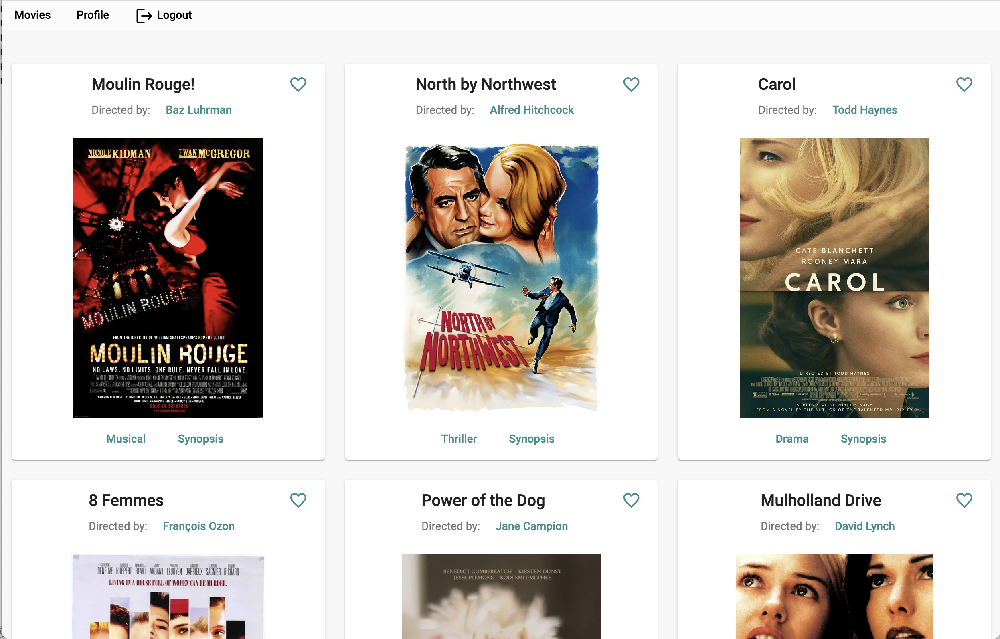
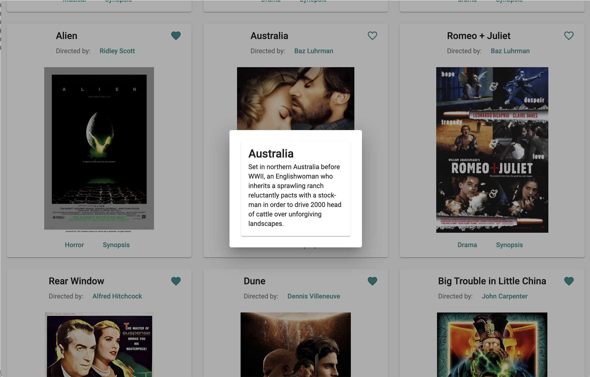
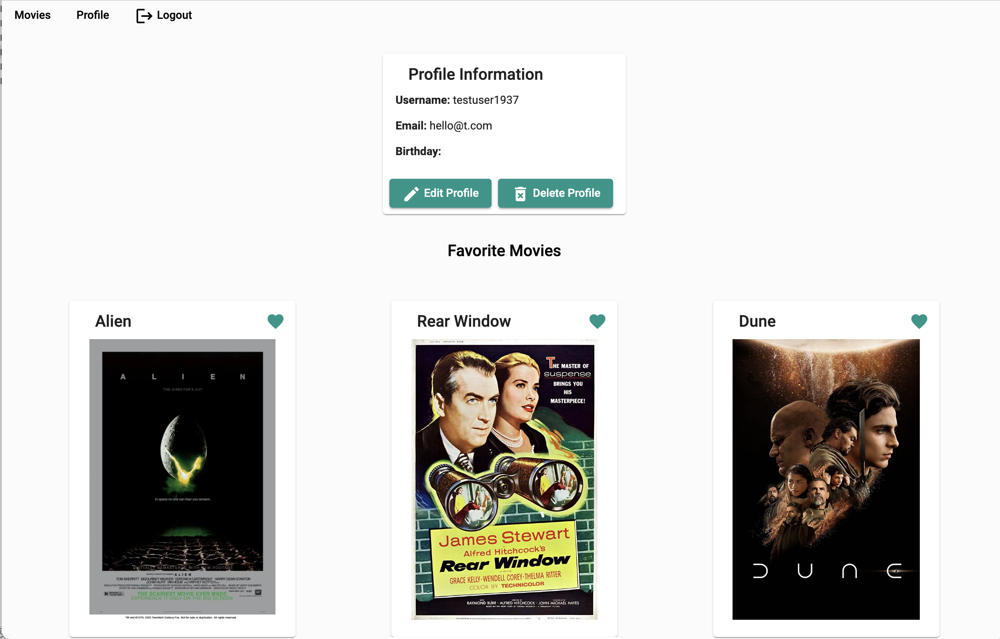

# Flicking through Flicks - Angular

## Project Description

Flicking through Flicks is a client-side application, created with Angular based on the existing server-side code (REST API and mongo database) from a previous task.
The goal was to rebuild the app previously created using React now using Angular.
This project was generated with [Angular CLI](https://github.com/angular/angular-cli) version 14.0.3

## Key Features

* The app opens a welcome page where users can log in or register
* Once logged in, the user will see all the movies on the database
* The user can access details about each movie (director info, genre info and synopsis) and can add movies to their list of favourites 
* The user can access their profile and edit their details

## Technologies Used
Angular, Angular Material

## Dependencies
* Database hosted in MongoDB
* [MovieAPI](https://github.com/mareeanamaro/movieAPI) hosted at heroku

## Links
* **Repository:** https://github.com/mareeanamaro/myFlix-Angular-client
* **Live link:** http://my-flix-angular-client.vercel.app/

## Screenshots

## How to Use
### Development server

Run `ng serve` for a dev server. Navigate to `http://localhost:4200/`. The application will automatically reload if you change any of the source files.

### Code scaffolding

Run `ng generate component component-name` to generate a new component. You can also use `ng generate directive|pipe|service|class|guard|interface|enum|module`.

### Build

Run `ng build` to build the project. The build artifacts will be stored in the `dist/` directory.

### Running unit tests

Run `ng test` to execute the unit tests via [Karma](https://karma-runner.github.io).

### Running end-to-end tests

Run `ng e2e` to execute the end-to-end tests via a platform of your choice. To use this command, you need to first add a package that implements end-to-end testing capabilities.

### Further help

To get more help on the Angular CLI use `ng help` or go check out the [Angular CLI Overview and Command Reference](https://angular.io/cli) page.
